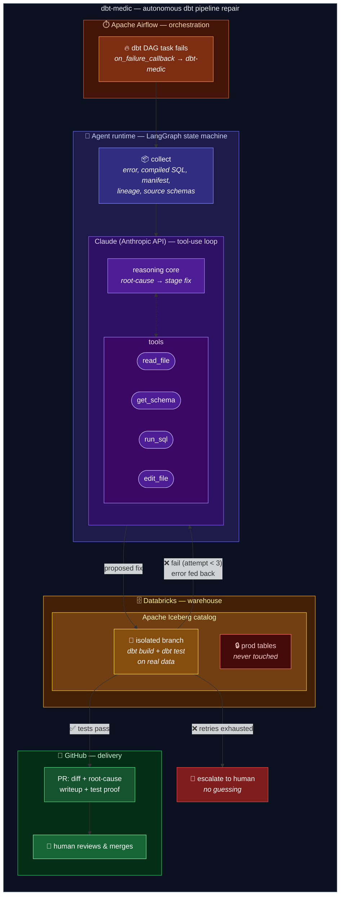

# dbt-medic

An autonomous "AI data engineer" that fixes broken dbt pipelines.

When a dbt model fails in Airflow, dbt-medic root-causes the error, writes the
fix, proves it on an isolated Iceberg branch against real data, and opens a PR
with the diff, a root-cause writeup, and passing tests. The human reviews and
merges — the agent never touches prod.

## How it works

dbt-medic is a full AI agent, built as a **LangGraph state machine** around a
tool-using Claude core. It doesn't run one prompt — it investigates, acts,
observes results, and self-corrects until the pipeline is green or it decides
a human is needed.

## Architecture



**Key tech:** Apache Airflow (failure trigger) · dbt (models, build, tests) ·
LangGraph (agent state machine, retry routing) · Claude / Anthropic API
(tool-using reasoning core) · Databricks + Apache Iceberg (isolated
write-audit-publish branches) · GitHub (PR delivery).

- **collect** — gathers the failing model, compiled SQL, error text, dbt
  artifacts, and upstream lineage into a structured failure context.
- **agent** — Claude with tools (`read_file`, `get_schema`, `run_sql`,
  `edit_file`) runs an inner tool-use loop: inspect the project, query the
  warehouse, root-cause the failure, stage a fix.
- **validate** — applies the fix on an isolated Iceberg branch (dev-schema
  fallback) and runs `dbt build` + tests there against real data. Failures
  route back to the agent with the error in state; after N attempts it
  escalates to a human instead of guessing.
- **publish** — opens a GitHub PR with the diff, a root-cause writeup, and
  the branch test proof. The agent never touches prod; the human merges.

## Install

```sh
uv tool install dbt-medic
```

Then add the Airflow hook:

```python
from dbt_medic.airflow import on_failure_callback
```

## Status

Early development — Databricks Fellowship project.
