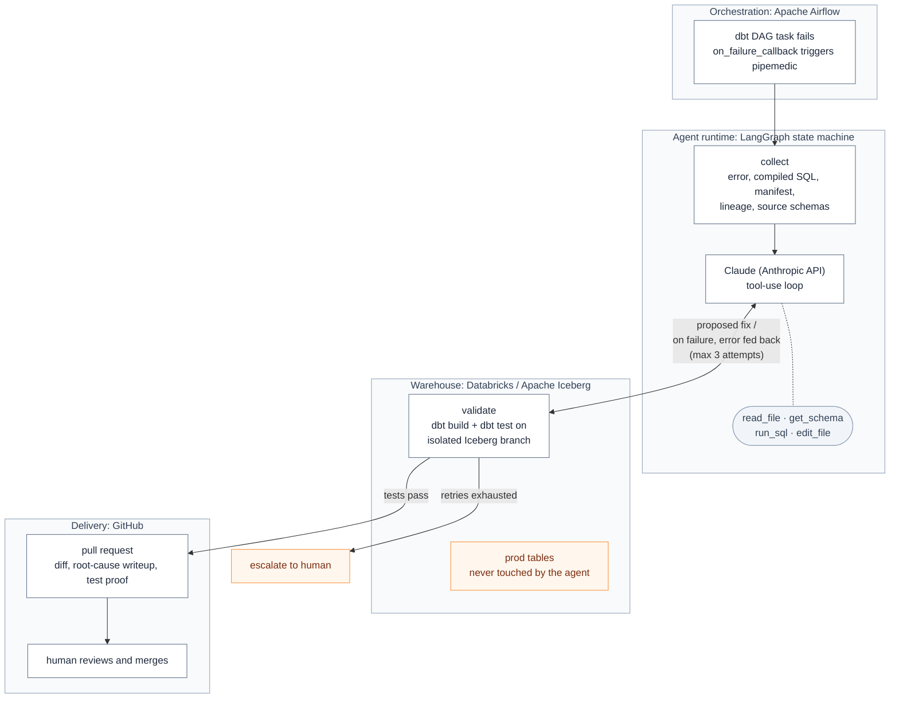

# pipemedic

An autonomous data engineering agent that fixes broken dbt pipelines

When a dbt model fails in Apache Airflow, pipemedic root-causes the error, writes the
fix, proves it on an isolated Iceberg branch against real data, and opens a PR
with the diff, a root-cause writeup, and passing tests. The human reviews and
merges, andthe agent never touches prod: a win-win situation.

## How it works

pipemedic is a full on AI agent, built as a **LangGraph state machine** around a
tool, using Claude core. It doesn't just run one prompt, it investigates, acts,
observes results, and self-corrects until the pipeline is green or it decides
a human is needed.

## Architecture Diagram



**Key tech:** Apache Airflow (failure trigger) · dbt (models, build, tests) ·
LangGraph (agent state machine, retry routing) · Anthropic API
(tool-using reasoning core) · Databricks + Apache Iceberg (isolated
write-audit-publish branches) · GitHub (PR delivery)

- **collect** — gathers the failing model, compiled SQL, error text, dbt
  artifacts, and upstream lineage into a structured failure context.
- **agent** — Claude with tools (`read_file`, `get_schema`, `run_sql`,
  `edit_file`) runs an inner tool-use loop: inspect the project, query the
  warehouse, root-cause the failure, stage a fix.
- **validate** — applies the fix on an isolated Iceberg branch (dev-schema
  fallback) and runs `dbt build` + tests there against real data. Failures
  route back to the agent with the error in state; after N attempts it
  escalates to a human instead of guessing.
- **publish** — opens a GitHub PR with the diff, a root-cause writeup, and
  the branch test proof. The agent never touches prod; the human merges.

## Install

Not on PyPI yet. Install from git, or clone and sync with `uv`:

```sh
uv tool install git+https://github.com/kidskoding/pipemedic
```

```sh
git clone https://github.com/kidskoding/pipemedic
cd pipemedic
uv sync
```

## Configuration

Settings are read from environment variables, all prefixed `PIPEMEDIC_`:

| Env var | Field | Default |
| --- | --- | --- |
| `PIPEMEDIC_ANTHROPIC_API_KEY` | `anthropic_api_key` | — |
| `PIPEMEDIC_GITHUB_TOKEN` | `github_token` | — |
| `PIPEMEDIC_GITHUB_REPO` | `github_repo` | — |
| `PIPEMEDIC_DATABRICKS_HOST` | `databricks_host` | — |
| `PIPEMEDIC_DATABRICKS_TOKEN` | `databricks_token` | — |
| `PIPEMEDIC_DATABRICKS_WAREHOUSE_ID` | `databricks_warehouse_id` | — |
| `PIPEMEDIC_DEV_SCHEMA` | `dev_schema` | `pipemedic_dev` |
| `PIPEMEDIC_USE_ICEBERG_BRANCH` | `use_iceberg_branch` | `true` |
| `PIPEMEDIC_MAX_RETRIES` | `max_retries` | `3` |

## Usage

### CLI

```sh
uv run pipemedic fix --model <failed_model> --project-dir <dbt_project>
```

Exit 0 with `PR opened: <url>` on success, exit 2 with an escalation message
after retries are exhausted.

### Airflow

Opt in per-task by passing a `pipemedic` param and wiring the callback:

```python
from pipemedic.airflow import on_failure_callback

default_args = {"on_failure_callback": on_failure_callback}

dbt_task = SomeOperator(
    ...,
    params={"pipemedic": {"model": "stg_orders", "project_dir": "/opt/dbt"}},
)
```

Tasks without a `pipemedic` param are left alone.

### Evals

```sh
uv run python evals/run_evals.py
```

Runs the agent across the seeded broken-pipeline scenarios in `evals/` and
reports % auto-fixed, mean retries to green, and a failure taxonomy.

## Status

Early development — Databricks Fellowship project
